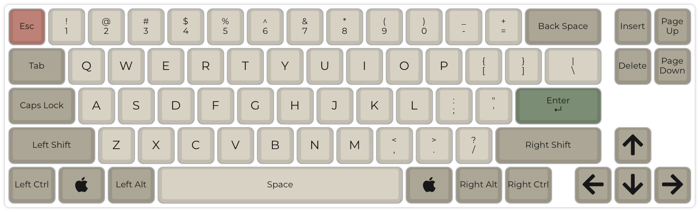
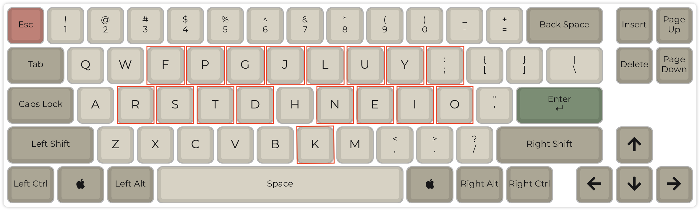
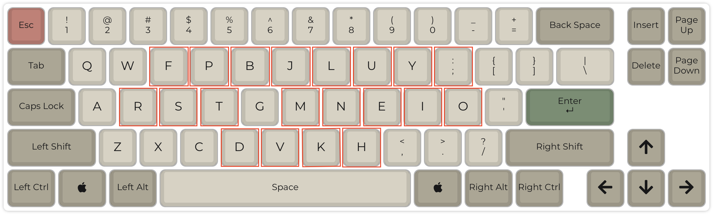
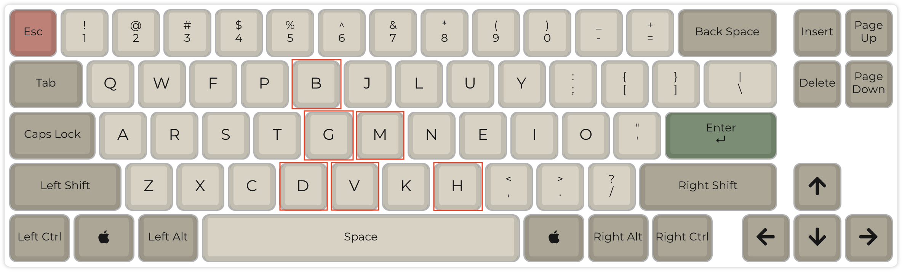

## Colemak keyboard layout

Colemak is an improved version of the QWERTY keyboard layout.
It isn't a completely new layout built from scratch, like Dvorak, but rather an evolution of QWERTY.
It tweaks QWERTY by rearranging keys in places where the original design is clearly inefficient. Improves "low-hanging fruits", significantly enhancing ergonomics and reduce unnecessary finger movement.
The fact that it is modified QWERTY makes it easier to learn when coming from QWERTY.
The decisions of which keys should go where is based on data, it's not all random decisions made by a single person.

*QWERTY layout for comparison.*

*Colemak layout with highlighted differences from QWERTY.*

> Note 1: When discussing keyboard layouts in this post I'm focusing only on the alphanumeric keys. This means that the position of modifiers or special keys like e.g. `Escape` is irrelevant.

> Note 2: Colemak is optimizing typing in **English**. Typing in Polish still feels a bit off to me sometimes, but I that's probably because I don't do it that often nowadays.

## The story of QWERTY

QWERTY wasn't designed for speed or ergonomics.
Have you ever wondered why our keyboards look like they do?

It all goes back to 19th century!
When mechanical typewriters were invented in the 1870s, the metal arms (typebars) that struck the paper would often collide and stick if two neighboring letters were pressed quickly one after another. To reduce this, Christopher Sholes (the inventor of the typewriter) rearranged the keys to spread out commonly paired letters. That's how the now-familiar QWERTY pattern emerged.

Once typewriters using QWERTY became commercially successful and schools started teaching it, the layout stuck - even long after jamming was no longer an issue. Today, in digital era, it's mainly inertia and standardization that keep QWERTY in place.

## How exactly is Colemak better

Colemak is designed to minimize unnecessary finger movement and make typing more comfortable compared to QWERTY (and also Dvorak in some areas).

- **Home row focus:** The 10 most common letters sit on the home row. This means you spend far more time typing without leaving the most natural position - over **twice as much as in QWERTY**.
- **Less finger travel:** Fingers move far less overall - about half the distance of QWERTY - which reduces strain and speeds up typing.
- **Fewer awkward motions:** Colemak avoids excessive row-jumping, same-finger typing, and pinky stretches that QWERTY often forces.
- **Balanced load:** By grouping vowels on the right hand, it avoids long same-hand runs while keeping a good balance of hand usage, without overburdening weaker fingers.
- **Practical efficiency:** Unlike Dvorak, which prioritizes hand alternation at the cost of other trade-offs, Colemak strikes a balance between comfort, speed, and ease of learning.

> The keyboard **home row** is the central row of keys where your fingers rest when using proper touch-typing technique.
It provides a neutral starting position for typing, allowing your fingers to reach other keys efficiently.
The F and J keys typically have small raised bumps or notches that help you locate the home row by touch without looking.

## Colemak Mod-DH

This is the actual layout I'm using.
It's a slightly modified version of Colemak.
As the name suggests, the modification of Colemak was done mainly to optimize the placement of `D` and `H` to reduce awkward stretches there.

*Colemak Mod-DH with highlighted differences from QWERTY.*

*Colemak Mod-DH with with highlighted differences from Colemak*

As you can see, there are slightly more changes in comparison to QWERTY than in Colemak.
Most notably, moving `V` key to different position than in QWERTY is tricky because of how used we are to press `CMD/CTRL+C` + `CMD/CTRL+V`.

Fortunately, after practicing for a while, it doesn't really matter because once you build muscle memory for new keyboard shortcuts then you will be hitting the `CMD/CTRL+C` + `CMD/CTRL+B` without giving it any thought.

## Muscle memory

Muscle memory is your brain's way of automating repeated actions. Once you've practiced something enough - like riding a bike, playing a chord on guitar, or typing a word - your fingers just "know" what to do without you consciously thinking about it.

When I first read about alternative keyboard layouts, I didn't believe you could keep your QWERTY skills while learning a new one. But now I know it's true. With practice, your brain can build and maintain multiple typing habits side by side.

In my case, it works best when I keep layouts separated by keyboard. On my work laptop I mostly use QWERTY, but on my custom keyboards and personal MacBook I only use Colemak. Even the feel of the keys is enough to trigger the right muscle memory and switch my brain back into "QWERTY mode."

 > I can type in Colemak quite fast, as long as I don't look at the keyboard.
 > Once I start looking at the labels, my brain refuses to believe that I want to tap key labeled as `H` to get `M`.

## Should you care?

I got this question many times - is the change worth it?

And the answer is of course - it depends.

I've found the following rule of thumb when it comes to the keyboard setup:

- Hardware fixes posture and arms comfort.
- Layout and keymap fix finger movement comfort and efficiency.

> But actually I think it's more nuanced than that, because hardware also have impact on finger movement, because of different height of switches, different distance between switches, adjusted column placement to the finger's "range" (I'm looking at you Pinky!), etc.

I did the full journey of designing a custom ergonomic keyboard, figuring out the new keymap for it, and learning the Colemak Mod-DH layout on it.
And to me it was all worth it, but that's because I wanted to improve the ergonomics of how I work and also the efficiency of my coding and typing in general.

If you just want to get rid of pain in your wrists, then you don't have to move away from QWERTY.
That's what I recommended to my wife. In her case, we've ended up buying and assembling an ergonomic split keyboard for her, but she's still using QWERTY layout there.
Because she only cared about ergonomics, and didn't want to bother learning new layout.

And if you want to be more comfortable touch typing, not stretching your fingers so much to type very frequent letters like e.g. `T` or `P`, but don't care much about your posture, because you don't have issues with your wrists, back or neck, then, first of all, I envy you good health, and I think you can try `Colemak` layout and don't bother with any fancy keyboards.

So, to sum up, my suggestions would be:

- If your main issue is **posture/pain → change hardware first.**
- If your main issue is **typing comfort/efficiency → try Colemak.
- If you're curious and enjoy tinkering → go all in (custom keyboard + Colemak Mod-DH).
- And if you don't feel any discomfort while typing then maybe you don't actually need to change anything.

## Layout vs Keymap

You have probably noticed that I sometimes mention "keymap" here, and you might wonder what it is, and how it is different than a "layout".

I would define it like so:

- Layout defines where alphanumeric / symbol keys are placed on the keyboard.
- Keymap defines what is the behaviour of each key, when you tap it, when you hold it, when you tap it when some other modifier key is pressed.

> In short: layout tells you that the `J` key is between the `H` and the `K`. While in your keymap, you can define that tapping the `J` key twice fast enough, will act as if you tapped the `Escape` key.

I've created a separate <a href="/posts/ergonomic-keymap">post about my keymap</a> that I encourage you to read.

## Setup

To try `Colemak` on a MacBook you can go to Settings and search for "keyboard layouts". Then, when you pick English from the list of languages, you can pick `Colemak` from the layouts list.

To setup `Colemak Mod-DH` on my MacBook, I'm using [Karabiner Elements](https://karabiner-elements.pqrs.org) program, that can remap the behaviour of each key. I will share my profile config at the end of this post.

> Karabiner Elements software is very powerful, and you can use it to e.g. remap `CAPSLOCK` to `Backspace`, or `HJKL` to `Arrow keys` when `Fn` is pressed, etc.

To setup `Colemak Mod-DH` on Windows (work laptop), I've used [AutoHotKey](https://www.autohotkey.com). Though, it's not as easy to get started, and it's not as reliable as Karabiner Elements on a Mac. I'll link my config file below.

See also the "Download" section on the official Colemak layout website: [colemak.com/Download](https://colemak.com/Download).

> The most reliable solution though, is to have a programmable keyboard that you can reprogram yourself to use whatever layout you want. I plan to write a separate post about my keyboards, will reference it below.

## Closing thoughts

Switching to Colemak Mod-DH wasn't just about speed - it made typing feel smoother and more natural for me. If you spend hours typing every day, small improvements really add up. And even if you never leave QWERTY, knowing there are alternatives out there might inspire you to think differently about how you interact with your keyboard.
Happy typing!

## References

- [Official colemak layout website](https://colemak.com)
- [Colemak Mod-DH website](https://colemakmods.github.io/mod-dh/)
- [My Karabiner Elements config](https://github.com/radlinskii/dotfiles/blob/main/karabiner_config/complex_modifications.json)
- Post about my <a href="/posts/ergonomic-keymap">Ergonomic keymap</a>
- Post about my <a href="/posts/ergonomic-keyboard">Ergonomic keyboard</a>
