## An unexpected journey

What started as a simple attempt to reduce wrist pain quickly turned into an exploration of how much the keyboard - something we barely think about - shapes comfort, speed, and even joy while typing.
I expected to buy one ergonomic keyboard and move on with my life.
Instead, I accidentally picked up a new hobby and new skills, like soldering and even CAD design.

> In this post, I'm talking about keyboards and their features purely from the hardware perspective.
Be sure to check out the other two posts in my "ergonomic typing" series: the <a href="/posts/ergonomic-keyboard-layout">Ergonomic keyboard layout</a> and the <a href="/posts/ergonomic-keymap">Ergonomic keymap</a> as the hardware is only part of the full story.

## How it started

I was using the built-in MacBook keyboard together with Apple's Magic Keyboard when I started my career as a programmer.
Then I started having pain in my wrists and I began looking for an ergonomic keyboard on the internet.

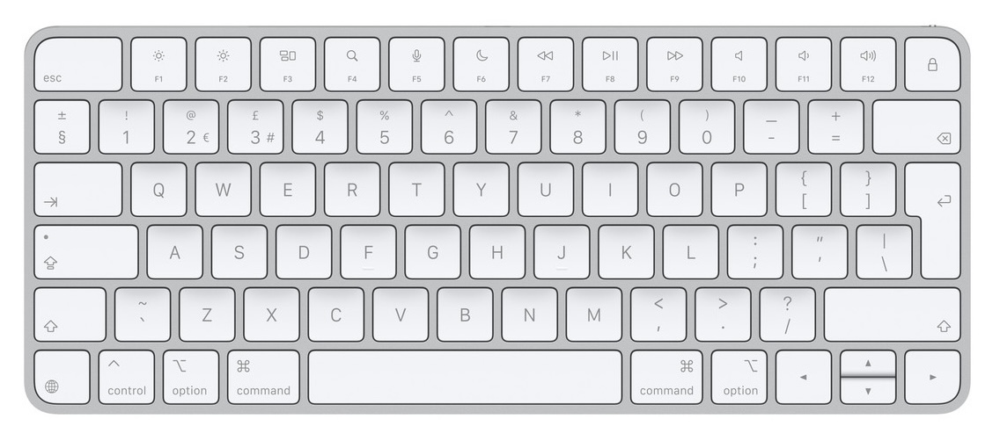
*Apple Magic Keyboard*

I found Logitech's K860 and sent a request to my employer to buy it for me.
It's a bit tilted, the left-hand and right-hand keys are separated, but the keys are still laid out using the typical row stagger.
This means it's easy to get used to writing on it - as long as you're using the correct fingers for each key.
As it turned out, I wasn't. So I started learning proper **touch-typing** techniques when using this keyboard.

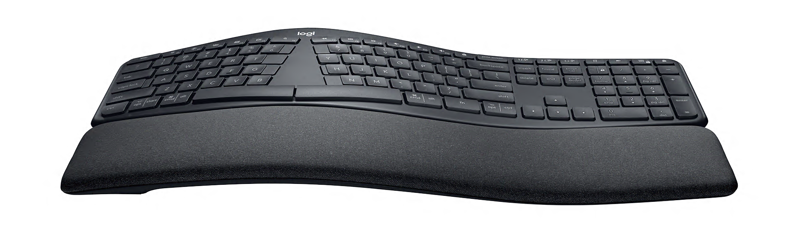
*Logitech's K860*

Unfortunately, it wasn't enough. There is some additional space between the left and right hands, but it's not split into two separate blocks.
It still has lots of keys that I had to find to press.
And it still puts a lot of strain on the wrists and pinkies, while the thumbs are not utilised.

Looking for this keyboard already made me question the way I type, and what a keyboard could do.
I've stumbled upon the [r/ErgoMechKeyboards subreddit](https://www.reddit.com/r/ErgoMechKeyboards/) and before I knew it, I had fallen head‑first down the rabbit hole.

## How it is going

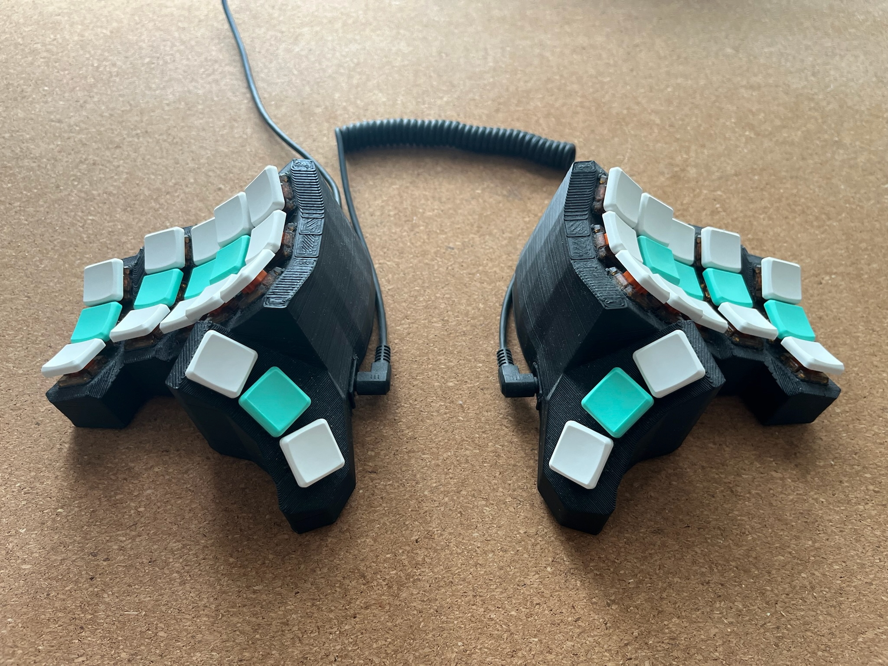
*Mecha Basilisk is my daily driver now. It's a keyboard of my own design.*

I've switched keyboards a couple of times in my search for perfection.
Eventually I ended up designing my own keyboard in CAD, because the ready solutions that would suit my needs were very expensive - and they wouldn't be exactly what I wanted anyway.

## The features

In the following sections, I'll go through the features of an ergonomic keyboard that I explored and share the story of all the keyboards I tried along the way.

### Split

Split keyboards let me open up my chest.
It's a real relief for my shoulders and neck.
On a unibody keyboard, if you try to have a more open chest, then you need to curve your wrists on the keyboard to compensate for hands coming from outside of the keyboard.
On a split keyboard, your wrists can go in straight lines.
If you use a wireless keyboard, then you can have your hands as far apart as you want.

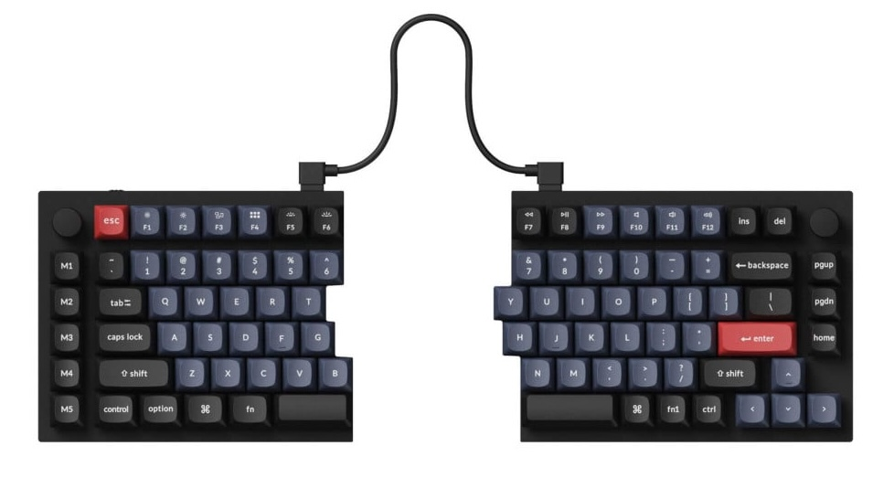
*Keychron Q11 is a split keyboard (that doesn't really have any other ergonomic feature I recommend)*

After Logitech's K860, I knew that I needed a keyboard that was fully split, not just angled.
I wanted something programmable, not too expensive, and that I wouldn't need a soldering iron to assemble.
After a lot of research I ended up buying [Iris](https://keeb.io/collections/iris-split-ergonomic-keyboard).

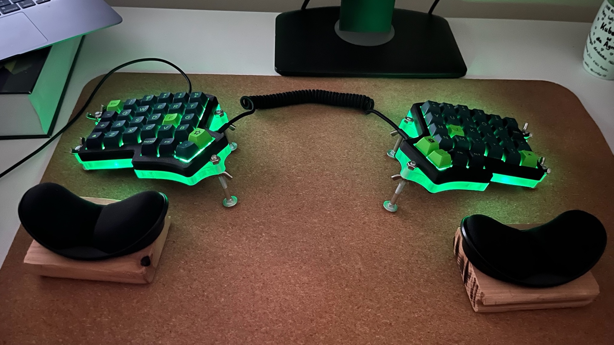
*My Iris keyboard preview.*

### To stagger or not to stagger

> 1876 called, it wants its staggered rows back.

As you probably know, we have to thank the typewriter's legacy not only for the QWERTY layout, but also for the fact that the keys on a keyboard are not vertically aligned.
For example, take the `Q`, `A` and `Z` keys - they're shifted sideways instead of being in one straight column.
That layout wasn't designed with hands or ergonomics in mind; it was designed around mechanics.

Early typewriters used [typebars](https://en.wiktionary.org/wiki/typebar): long metal arms that had to swing upward to hit the paper.
If two neighbouring typebars were triggered too close to each other, they would collide and jam.
The solution was to physically offset the keys so the corresponding typebars sat on different pivot points and wouldn't get tangled.
Ergonomics didn't even enter the conversation - the engineering priority was simply "make it not jam".

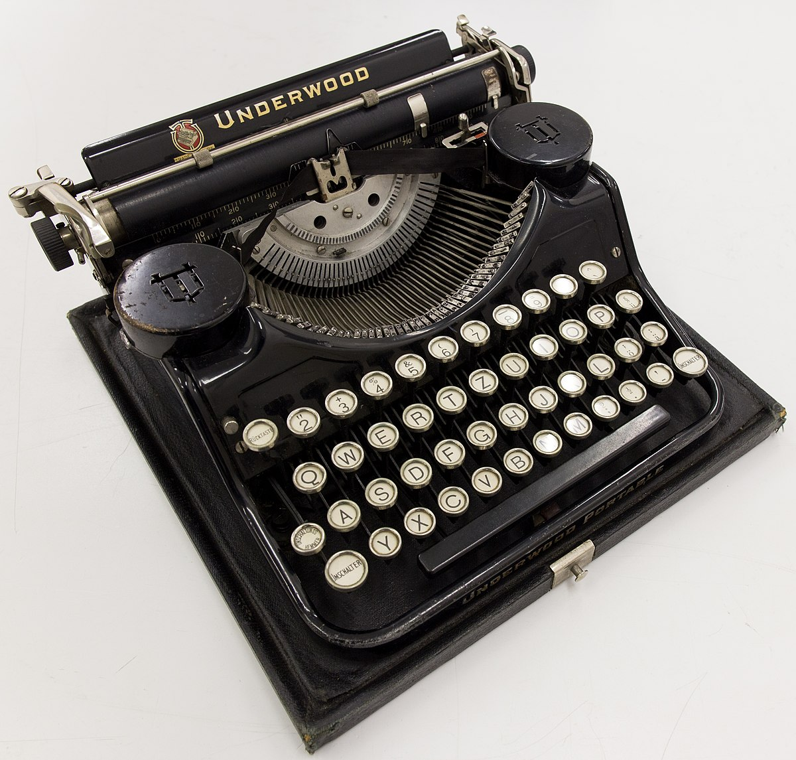
*Typewriter with visible typebars above the keys.*

But guess what - there are no typebars in modern keyboards, so there's no reason rows must be staggered.
We're still typing on a layout optimized for 19th-century mechanical constraints rather than for human hands.

#### Ortholinear keyboards

An ortholinear key layout means that the keys are aligned in uniform rows and columns, forming a grid pattern.

To me, *Ortholinear* keyboards are a bit extreme, and I don't think they are that ergonomic to be honest.

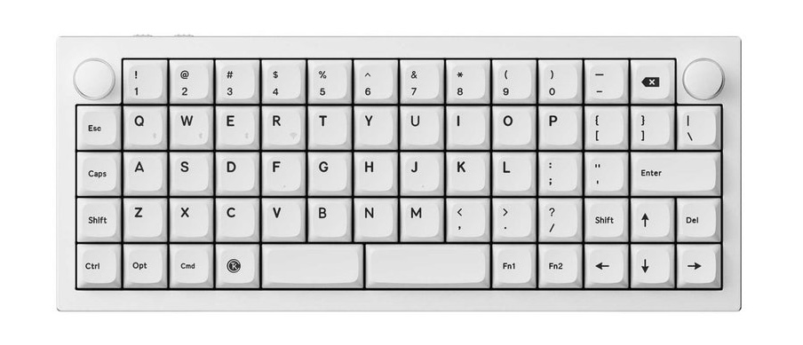
*Keychron Q15 Max is an example of an ortholinear unibody keyboard.*

#### Staggered columns

I think a much better solution is to have staggered keys, but not in rows as in typical keyboards, but in columns.
That's because if you look at your fingers you will notice that (most probably) your fingers have different lengths, and can travel different distances.
That's why I wanted the keyboard to have the pinky's column lower than the other columns so that it's easier for my pinkies to reach the keys.

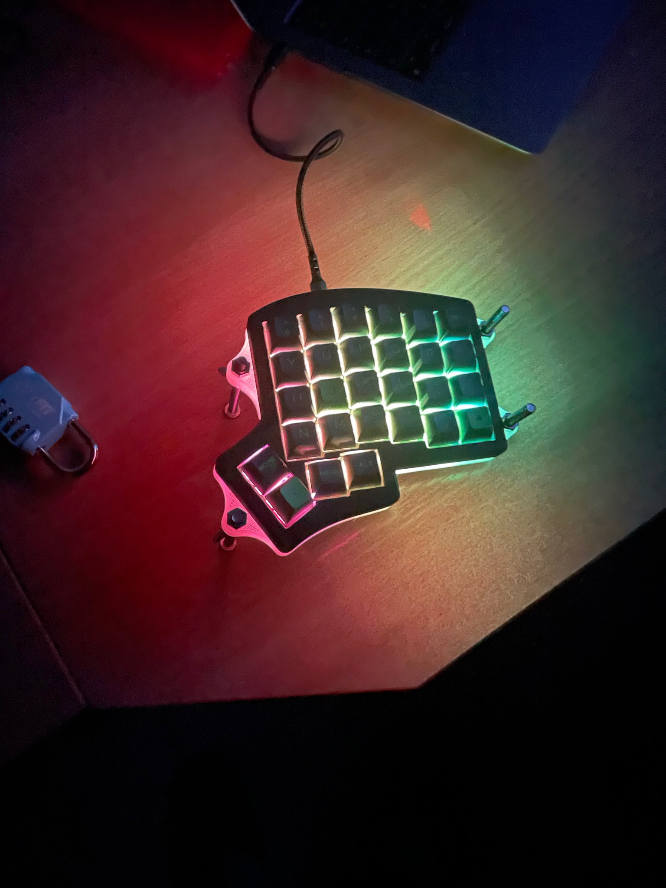
*Iris keyboard has slightly staggered columns.*

Ergonomic keyboards have different levels of column stagger.
The main reason I bought my next keyboard after the Iris - [Kyria](https://splitkb.com/products/kyria-rev3) was to have more "aggressive" stagger of the pinky's column, to make it even easier for my pinkies to reach the keys.
I had to buy a soldering iron to assemble it, because the switches are soldered directly to the PCB.

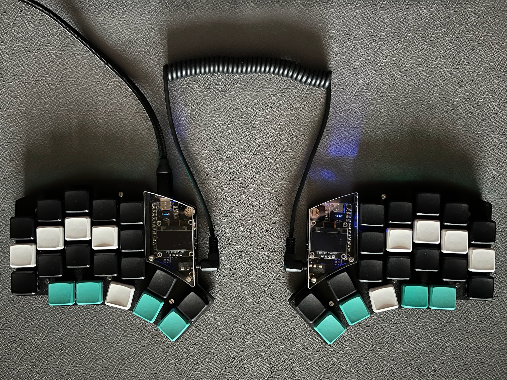
*Kyria keyboard has aggressive columnar stagger.*

#### Splay

When you fold your fingers to form a fist and unfold them, chances are that you will see that the index finger, middle finger, and the ring finger are moving up and down, but the pinky is a bit "off".
It goes a bit more to the side.
At least that's what I see my fingers do.
That's why, another ergonomic keyboard feature I considered was *the splay*.

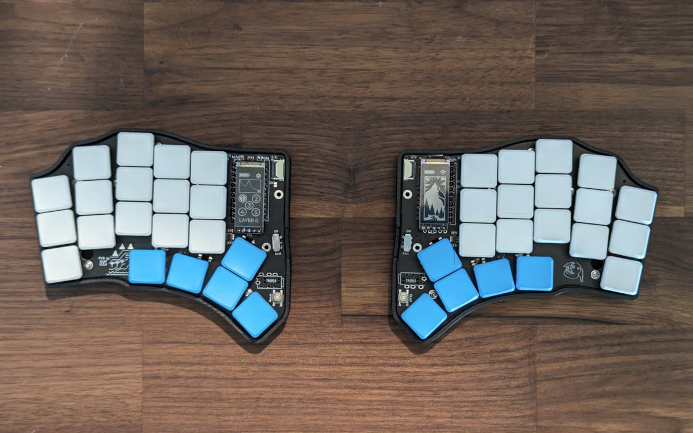
*[Hillside 46](https://github.com/mmccoyd/hillside) is an example of splayed keyboard.*

Eventually, I decided that I don't need it because as long as the pinky's column is lower than the other columns reaching keys is easy enough.
And I really wanted to have a keyboard with only 36 keys, because I've developed a keymap that only needs 36 keys, and having keys that I didn't use was really bad for my OCD.

### Choc switches

Choc V1 switches are low-profile switches.
Meaning they don't travel as far as, for example, MX switches to "get pressed".
This could be considered more ergonomic, because it puts less strain on your fingers if you type all day.
Although, that's a highly personal thing.

On the Iris, I was using MX switches, coming from Apple's Magic Keyboard I missed having low-profile keys very much and that's why the next keyboard that I bought was the Kyria which used Choc switches.

All of the keyboards after that were also using Choc V1 switches.
I don't like MX mechanical switches, please don't hate me for it.

*MX size switch on the left and Choc V1 on the right.*

### Choc spaced

Choc V1 switches require less space around them.
So the next change I wanted to do after the Kyria is to have a keyboard that is "Choc-spaced", meaning it is designed only for use with Choc V1 switches, and keys are as close to each other as possible.
Also, I wanted something small, and wireless, that's easy to take with me wherever I go.
That's why the next keyboard that I bought was [Chocofi](https://showcase.beekeeb.com/tag/chocofi/).
I still use it as my "travel keyboard".

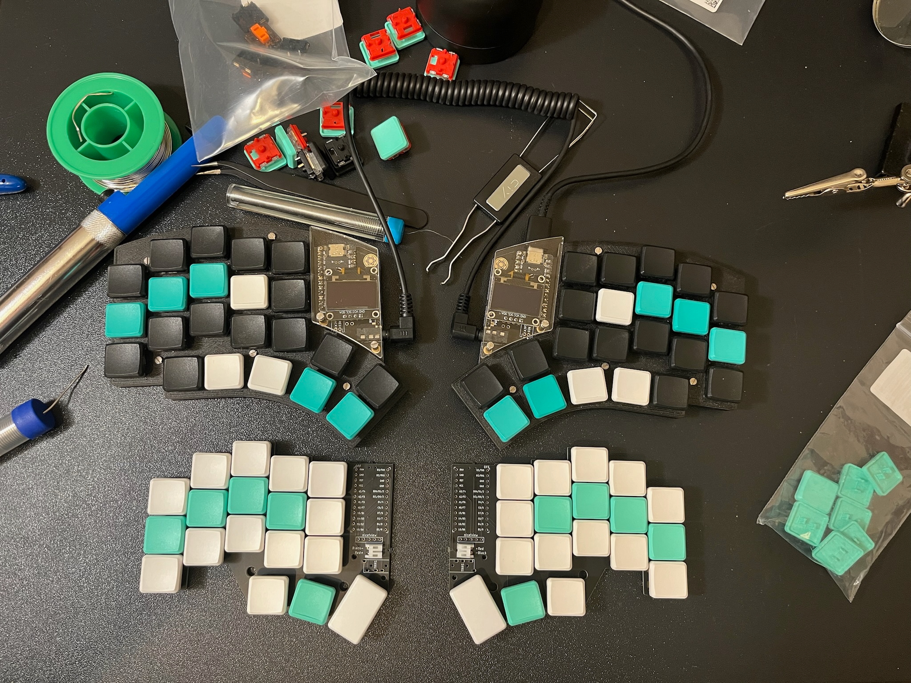
*The Kyria on top, Chocofi on bottom.*

### Tilted position

I'd guess this is even more personal than the column stagger, but if I put my hand on my desk, and keep it completely relaxed, then it's not touching the desk with all of the fingers, it's only the outer (pinky-side) side of the hand that touches the desk.
This means the more natural position for me is to have my hands tilted, not completely flat.
And I want to have my hands on my keyboard in the most natural position possible.
I achieved tilting the two halves of a split keyboard at the right angle in different ways:

- For the Iris, I 3D printed a case that had inserts for M5 screws that allowed me to adjust the angle.
- For my wife's Sofle V2, we printed triangular-shaped holders that she can put the keyboard on top of.
- I created the Basilisk keyboards to already be at the right angle.
- But the easiest solution that you can always do with any split keyboard is to put it at the edge of a thick book or a box.

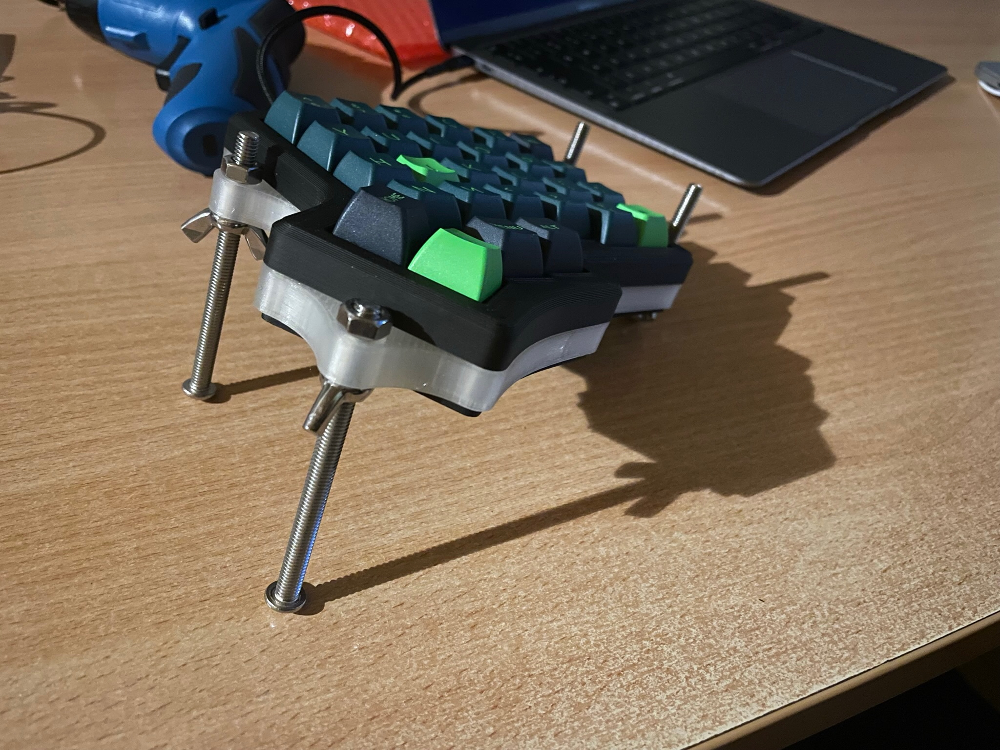
*The screw based solution for tenting my Iris keyboard.*

### Tilted thumb cluster

The thumb cluster is tilted at the opposite angle to the rest of the columns.
One of the greatest gifts of evolution to humankind is the opposable thumbs.
Why do we then try to use them **not** in their natural position, but instead we try to press keys that lie flat on the desk.

That's why the next keyboard after Chocofi was the [Basilisk](https://github.com/radlinskii/basilisk).
The keyboard that I designed myself in Fusion 360.
This was the first keyboard that I didn't even buy a PCB for.
Instead, I used wires to create the "matrix" of connections between keys that I soldered to a Raspberry Pi Pico microcontroller.
I still use it as my office keyboard.

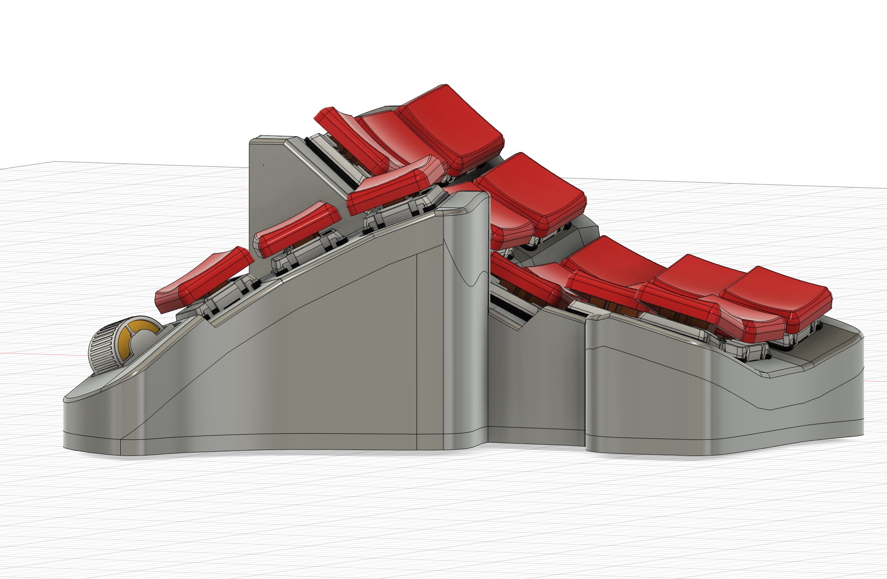
*I designed Basilisk to have a thumb cluster tilt that would fit me, but I had to guess what the angle should be, because I've never typed on such a keyboard before.*

I think it's worth mentioning here the [Moonlander](https://www.zsa.io/moonlander) keyboard, which has an adjustable thumb cluster.
It misses a couple of other features that I'd need in a keyboard but I find it really brilliant engineering to have the thumb cluster angle be configurable.

### Key-well shape

Keys are arranged in a concave shape rather than a flat grid.
Each finger has its own column which can have a different depth and height.
This shape is designed to reduce finger movement and strain.

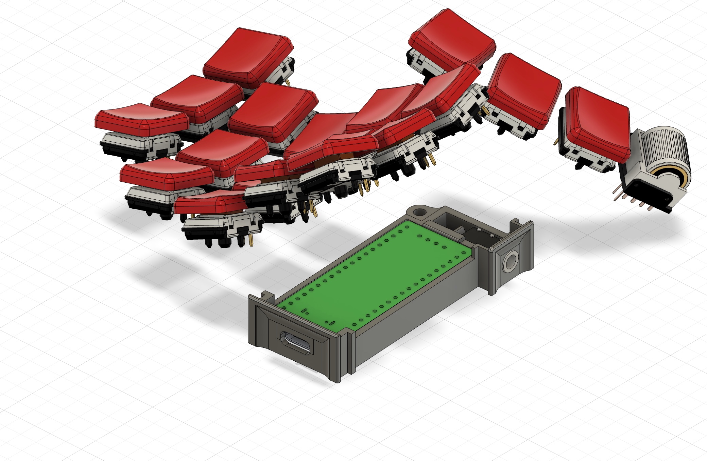
*A key-well design can't be applied to a flat keyboard that's why my Basilisk keyboard is tall and doesn't have adjustable tilt.*

## My Endgame

After creating the Basilisk, I knew that I was at the end of my quest for an ergonomic keyboard.
I decided that I needed a separate keyboard for the office and a separate one for my home office.
I slightly adjusted some of the tilt angles and the key positions of the Basilisk's design.
Also, I've removed the roller encoder from the thumb cluster because I rarely use it.
And so, the [Mecha Basilisk](https://github.com/radlinskii/mechabasilisk) was brought to life.

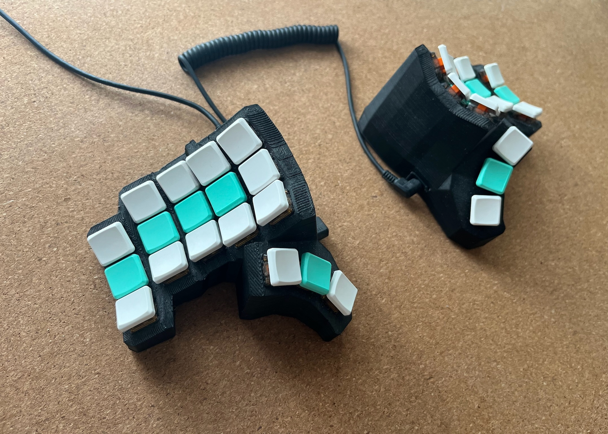
*The Mecha Basilisk name came to my mind because it's just a more angular version of the Basilisk keyboard.*

## Closing thoughts

After building the Mecha Basilisk, I have only built two more keyboards so far.
Two copies of [Sofle V2](https://splitkb.com/products/aurora-sofle-v2) for my wife.
One for the office and one for my home office.
It's a split keyboard with quite an aggressive columnar stagger, for which we used Choc switches and 3D printed stands to tilt it.
She wanted to keep the number row, and she didn't mind not having the tilted thumb cluster, Choc-spaced keys or the concave shape of the keyboard.

*Wireless Sofle V2 with 3D printed tilt stand.*

So, as you can see, you can mix and match the features that make a keyboard ergonomic.
My goal was just to show you what the available options are.
I couldn't convince my wife to use the exact same keyboard that I use, so I'm not going to try to convince you.

You can buy ready-to-use keyboards, keyboards you can program yourself, or some that have software for configuring them.
You can buy just PCBs that you have to solder or PCBs that let you plug in the switches.
You can also reuse or design something completely new and "handwire" it.

After some trial and error (*Logitech K860*, *Iris*, *Kyria*), I’ve come to the end of my journey, and I'm off to different side projects, but maybe you can use some of what I learned for your ergonomic setup.

> I encourage you to see the other two posts in my "ergonomic typing" series - the <a href="/posts/ergonomic-keyboard-layout">Ergonomic keyboard layout</a> and the <a href="/posts/ergonomic-keymap">Ergonomic keymap</a> to get to know what actions a keyboard can perform and how it's possible that I only need 36 keys.
