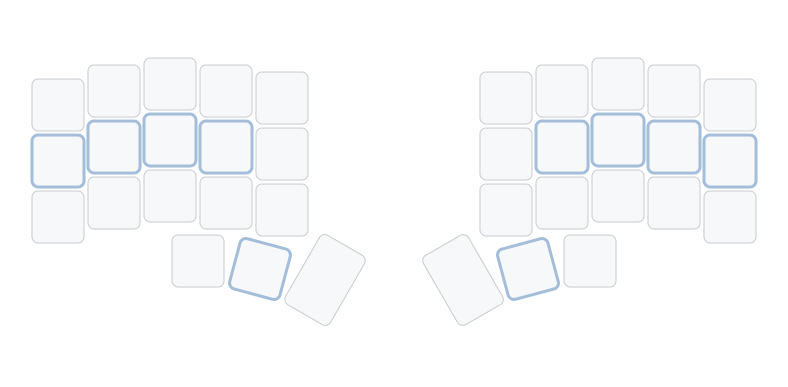
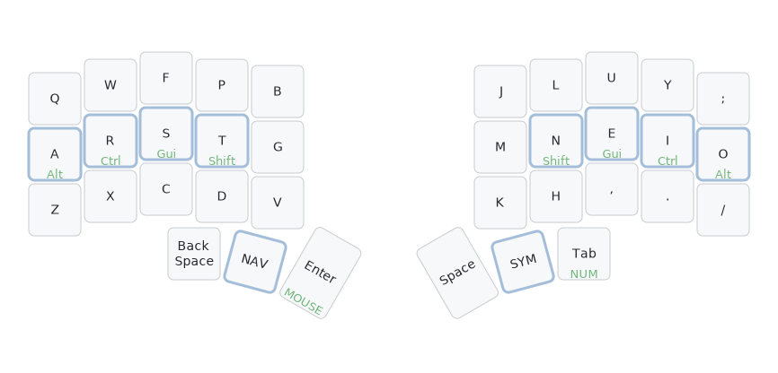
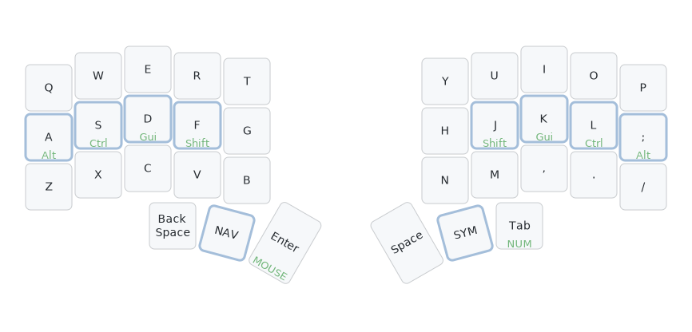
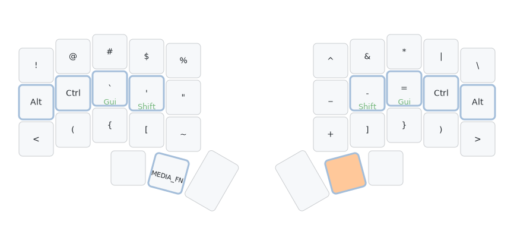
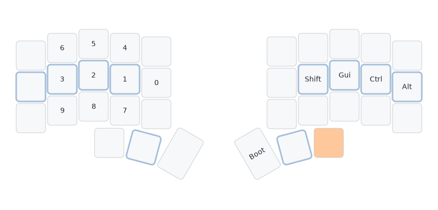
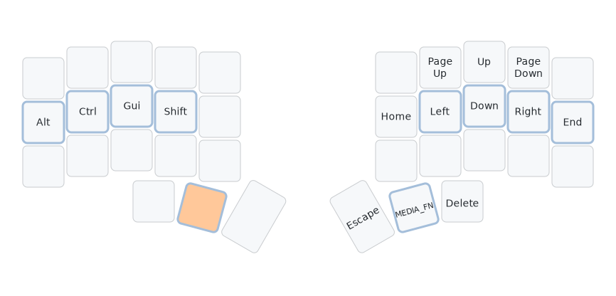
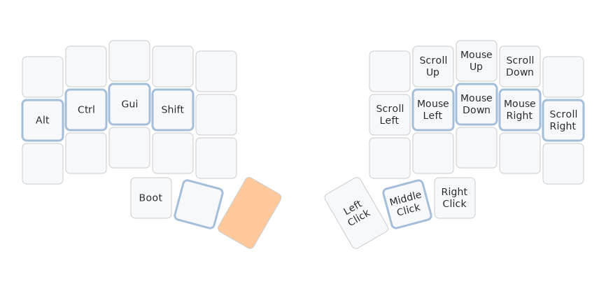
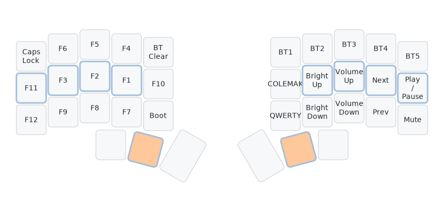

## What is a keymap

A *keymap* defines what each key on a keyboard does.
A keymap may be very simple… or very complicated.
Depending on your keymap you might need 108 physical keys to perform every possible action of your keyboard or, as in my case, just 36.

### Keymap vs Layout

To me, a keyboard *layout* is just one aspect of a *keymap*.
Layouts (QWERTY, Colemak, Dvorak, etc.) decide where the letters and symbols go, while a keymap can add much more: layers, modifiers, macros, and beyond.
I'll walk through those features in the next sections.

> Layout tells you that the `J` key is between the `H` and the `K`. While in your keymap, you can define that tapping the `J` key twice fast enough, will act as if you tapped the `Escape` key.

### How to configure a keymap

#### Keyboard firmware

The best way is usually having a keyboard that can be programmed by flashing it with custom firmware.
For some keyboards, [QMK](https://qmk.fm) or [ZMK](https://zmk.dev) can be used for this purpose.
Some other keyboards have their own software that enables you to flash new firmware.

#### Host software

Some modifications can be done using software that you can install on your "host" machine, as opposed to flashing firmware on the keyboard itself.

I've used [Karabiner Elements](https://karabiner-elements.pqrs.org) to enhance my MacBook's builtin keyboard.
It's not as powerful a setup as my custom keyboards', but at least it solves my biggest issue with "normal" keyboards - the arrow keys.
On my MacBook, when I hold `Caps Lock` key my `I`, `J`, `K`, and `L` keys become arrow keys.
I've used Karabiner also to change the layout to "*Colemak Mod-DH*", as described in my other <a href="/posts/ergonomic-keyboard-layout">post about Colemak layout</a>.

Apart from Karabiner Elements for *Mac*, there is also [AutoHotKey](https://www.autohotkey.com) on *Windows* and [KMonad](https://github.com/kmonad/kmonad) that can be used on *Linux*, *Mac* and *Windows*.

> Turning `Caps Lock` into `Backspace` is also a very popular modification.

## My Keymap

I want to present to you the *keymap* I'm using for each of my custom keyboards.
I use *QMK* for defining it for cabled keyboards and *ZMK* for defining it for my wireless keyboards.

### Everything in 36 keys

Yes, there are only 36 physical keys needed for creating this keymap, and here is why I find this preferable:

- Everything is at a distance of *at most* one key away from the keys your fingers rest on.
- No need to look for any key that's too far to reach using only muscle memory.
- No more stretching your fingers to find arrows, `Backspace`, `Escape`, etc.
- Only fingers are moving, there is no stress on the wrists.
- Utilizing the thumbs more, while letting the pinkies rest.

> Note about the above and the following pictures:
>
> - The *resting positions* of the fingers are marked with the thicker blueish border.

### Layers

Layers are what enable my keyboard to fit every "digital key" that I need on just 36 "physical keys".
When I hold a *layer key*, I enter a new layer, and when I release that key, I'm back to the default layer.

Layers work just like the `Shift` key.
When you hold `Shift`, `a` becomes `A`, and `/` becomes `?`.
In the same way, holding a layer key can transform the entire keyboard layout - from letters to collection of symbols, numbers, arrows, etc.

I have two keys dedicated to switching to the most frequently visited layers under the resting positions of both of my thumbs.
Which means that I don't need to move my hand at all to reach for example arrow keys.
I can just press the key my left thumb is resting on, and suddenly the letter keys under my right hand are arrows instead.
I love this setup, especially because every time I switched keyboards before, the arrow keys where in slightly different places, and getting used to them was very annoying to me.

My keymap is composed of several layers, each designed for a specific function: letters, symbols, numbers, navigation, and media controls.
Let's have a closer look at each of them.

#### Colemak (default)

This is the default layer that the keymap is in.
It contains the Colemak Mod-DH layout of alphabetic keys. If you want to know more about this layout, I've written a separate  <a href="/posts/ergonomic-keyboard-layout">blog post about it here</a>.
From here, to switch to 4 other layers I just need to hold one of the keys in the thumb cluster.
Notice that there are no dedicated keys for modifiers e.g. `Shift`. Instead some of the letters can work as modifiers when held, but still be letters when just tapped. More on this below, in the *Home Row Mods* section.

> Note about the above and the following pictures:
>
> - The *hold* behavior indicated by the green color is below the tap behavior.
> - The underlined uppercase text is for keys switching to different *layers*.

#### QWERTY

It only differs from *Colemak* in the position of some of the letter keys.
I've added this layer in case someone not familiar with *Colemak* would need to use the keyboard.

#### Symbols

Top row is almost the same as symbols on number row in typical QWERTY layout.
Modifiers are available again on both hands, to enable performing all kinds of keyboard shortcuts with ease.
Opening and closing brackets of each type are placed symmetrically on both halves of the keyboard.

> Note about the above and the following pictures:
>
> - The key that needs to be held to switch to this layer is indicated by the orange color.
> - Empty keys on the picture are *transparent*, which means they are the same as the default layer.

#### Numbers

At first glance my number layer looks a bit… chaotic.
I wouldn't blame you for thinking *"what the hell happened here?"*.
The reason is simple: lower numbers are used more often than higher ones.
So I placed `0`, `1`, `2`, and `3` right on the home row where my fingers rest.
Since switching to a custom keyboard requires building new muscle memory anyway, I figured I might as well optimize from the start.

#### Navigation

Most of the navigation is on the *Home Row*. However, since I'm not using QWERTY, which means the typical VIM navigation on `H`, `J`, `K` and `L` doesn't apply, I figured I might put arrows in a more natural placement with the `Up Arrow` above the `Down Arrow`.

#### Mouse

Mouse movement keys are in the same positions as the *Arrow* keys in the *Navigation* layer.
It's not too pleasant to use as main way to navigate the cursor, but the scrolling, however, is very useful.

#### Media / Fn

To access this layer, the middle keys in both thumb clusters need to be pressed.
*F* keys are placed in similar way that numbers are placed in the *Numbers* layer.
Media keys - useful for controlling your computer and keyboard settings - are also here.
As seen in the picture, on wireless keyboard I control the bluetooth settings here. On wired keyboards that have LEDs there are LED controls instead.
This is also the layer where the `Caps Lock` key has found its place.
It's also worth noting that this layer includes keys that let me switch between *Colemak* and *QWERTY* as the default layer.

### Home row mods

As seen in some of the layers, keys can have different behavior when tapped and different when held.
This means I don't need additional dedicated keys for *modifiers* at all. In my keymap modifiers are always on the *Home Row*.
Sometimes they have different behavior when tapped, like in the *Colemak* layer and sometimes they are treated only as modifiers as in the *Navigation* layer.

I really like this feature because it makes performing complicated keyboard shortcuts trivial without stretching my fingers.

## Other keymap features

### Tap dance

I was using it for some time for switching to different layers, and sending different keycodes on when double tapping a key, but eventually I ended up modifying my keymap to only navigate between layers by holding 1 or 2 keys.

If I would have a dedicated `Shift` key, I would definitely configure it to work as `Caps Lock`
when double tapped.

### Custom macros

Macros enable you to send multiple key press signals with just a single keystroke. For example, can have a key that, when pressed, sends multiple keypresses which put together would make text `"Hello world!"`.

I don't use it currently, but I'm considering adding a macro that sends my e-mail address.

## Closing thoughts

A well-designed keymap is what truly unlocks the potential of any keyboard - it's the bridge between hardware and comfort.
Even with great hardware you need a proper keymap to actually make it work for you.
And with a great keymap, you can still have a good experience - even with less ergonomic hardware.

## References

- QMK Firmware of my keymap for Mecha Basilisk keyboard on [Github](https://github.com/radlinskii/mechabasilisk/tree/main/qmk_firmware)
- ZMK Firmware of my keymap for Chocofi keyboard on [Github](https://github.com/radlinskii/chocofi-zmk-config)
- Post about my <a href="/posts/ergonomic-keyboard-layout">Ergonomic keyboard layout</a>
- Post about my <a href="/posts/ergonomic-keyboard">Ergonomic keyboard</a>
- Tool for creating the keymap visualisations: [Keymap Drawer](https://keymap-drawer.streamlit.app)
